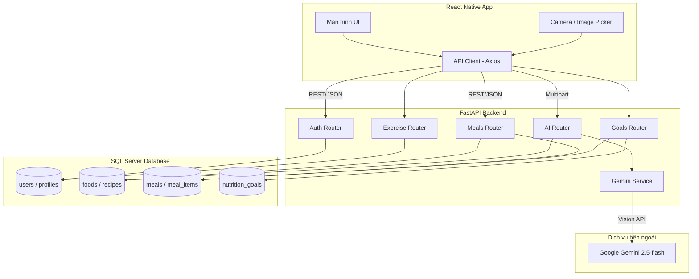

# Kiến trúc hệ thống - Nutrition AI App

## Tổng quan



## Luồng xử lý chính

### 1. Đăng ký & Thiết lập hồ sơ

```
User → Register → Login → Onboarding (nhập chiều cao, cân nặng, mục tiêu)
     → Backend tính BMI, BMR, TDEE → Lưu user_profiles → Vào màn hình chính
```

### 2. Nhận diện món ăn bằng AI

```
User chụp/chọn ảnh → Upload multipart/form-data → FastAPI
→ GeminiService.recognize_food() → Gemini 2.5-flash phân tích
→ Trả danh sách món + độ tin cậy → Đối chiếu DB foods
→ User xác nhận → Tạo meal_item → Cập nhật tổng dinh dưỡng ngày
```

### 3. Gợi ý thực đơn thông minh

```
User yêu cầu gợi ý → Backend lấy profile + lịch sử ăn + calo còn lại
→ GeminiService.suggest_menu() → Trả thực đơn Sáng/Trưa/Tối/Phụ
→ User có thể áp dụng (trạng thái "planned")
```

## Database Schema (tóm tắt)

| Bảng | Mô tả |
|---|---|
| `users` | Tài khoản (email, role) |
| `user_profiles` | Hồ sơ sức khỏe (BMI, BMR, TDEE, mục tiêu) |
| `foods` | Dữ liệu thực phẩm & dinh dưỡng |
| `food_categories` | Phân loại thực phẩm |
| `recipes` / `recipe_ingredients` | Công thức nấu ăn |
| `meals` / `meal_items` | Nhật ký bữa ăn |
| `nutrition_goals` | Mục tiêu dinh dưỡng |
| `exercises` | Dữ liệu tập luyện |
| `notification_settings` / `notifications` | Cài đặt & lịch sử thông báo |
| `ai_recognition_logs` | Log nhận diện AI |
| `user_reports` | Báo cáo/phản hồi từ user |

## Bảo mật

- JWT Bearer token cho xác thực API
- bcrypt hash mật khẩu
- Phân quyền `user` / `admin`
- CORS giới hạn origin mobile app

## Mở rộng trong tương lai

- Admin Dashboard (React web)
- Push notification (Firebase Cloud Messaging)
- Tích hợp Google Fit / Apple Health
- Biểu đồ thống kê tuần/tháng
- Fine-tune model nhận diện món Việt Nam
